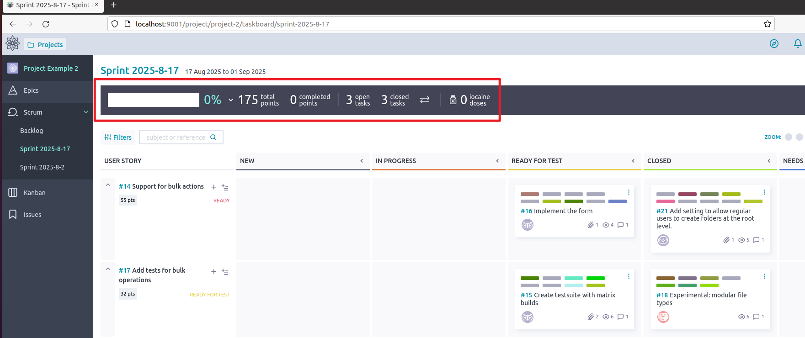

# CS5351 SE Meeting Report

## 第1次线上会议

主题: 讨论项目功能需求，基本框架，成员分工

会议时间: 2025年9月12日 22:00 

结束时间：2025.9.12 23:00

### 会议材料

功能描述、参考的GitHub链接和技术栈：

1. **分析 GitHub 仓库贡献情况（commit 数、代码行、时间线），自动生成网页报告**
   - **功能描述**：该功能的目标是通过分析GitHub仓库的贡献情况（如commit次数、代码行数、时间线等），生成一个自动化的网页报告。
   - **参考项目**：[RepoSense](https://github.com/reposense/RepoSense)
   - **技术栈**：Java + Spring Boot 后端，前端 Vue
2. **通过 GitHub API 拉取仓库数据，生成仪表盘（PR、commit、issue、活跃度）**
   - **功能描述**：通过GitHub API获取仓库的数据（如Pull Request、commit历史、issue活动等），并生成动态仪表盘，帮助团队监控项目进展和成员活动。
   - **参考项目**：[Git Insights](https://github.com/git-insights/git-insights)
   - **技术栈**：Node.js + React
3. **便于开发流程的管理与监控**
   - **功能描述**：通过管理和监控工具帮助开发团队高效管理开发流程，集中展示开发任务、进度等，提升团队协作与透明度。
   - **参考项目**：[eladmin](https://github.com/elunez/eladmin)
   - **技术栈**：Vue, Springboot, Mybatis
4. **Streamlit是一个用Python构建数据应用的开源框架，快速创建漂亮的数据可视化应用**
   - **功能描述**：Streamlit框架帮助快速构建交互式数据应用，用Python实现数据展示。
   - **参考项目**：[Streamlit](https://github.com/streamlit/streamlit)
   - **技术栈**：Python，适用于数据可视化
5. **可拖拽式卡片任务管理（类似于tutorial1的游戏），卡片标注任务内容、任务人、执行时间等**
   - **功能描述**：可拖拽的卡片式任务管理系统，任务通过卡片表示，包含任务内容、负责人和执行时间等信息。
   - **参考项目**：[young-datafan-ooooo1](https://github.com/young-datafan-ooooo1)
   - **技术栈**：Java + Vue
6. **自动化构建和部署的CI/CD流水线**
   - **功能描述**：建立自动化的持续集成和持续部署（CI/CD）流水线，提高开发效率和部署质量。
   - **参考项目**：[Jenkins](https://github.com/jenkinsci/jenkins)
   - **技术栈**：Jenkins, Docker, Kubernetes
7. **代码质量和覆盖率分析工具**
   - **功能描述**：自动化分析代码质量，并提供覆盖率报告，帮助开发团队提高代码质量。
   - **参考项目**：[SonarQube](https://github.com/SonarSource/sonarqube)
   - **技术栈**：Java, Jenkins, Docker
8. **自动化测试框架集成（UI与单元测试）**
   - **功能描述**：建立自动化测试框架，集成UI和单元测试，以保证代码的质量和稳定性。
   - **参考项目**：[Selenium](https://github.com/SeleniumHQ/selenium)
   - **技术栈**：Java, Selenium, TestNG
9. **自定义日志管理和数据分析平台**
   - **功能描述**：提供自定义日志管理和数据分析平台，帮助团队进行日志监控、错误检测和性能分析。
   - **参考项目**：[ELK Stack](https://github.com/elastic/elasticsearch)
   - **技术栈**：Elasticsearch, Logstash, Kibana (ELK)

### 会议结论

主要功能：CI/CD

备选目标：项目管理+任务分配+进展监控

任务：

	1. 找到代替Docker的技术栈
	1. 确定网站的具体功能，每人2个，需要介绍功能概况，想要达成的效果
	1. 截止周日晚，9月13日。

## 第2次线下会议

主题: 讨论项目功能需求，基本框架，成员分工

会议时间: 2025年9月15日 19:00 

结束时间：2025.9.15 21:00

地点：HA 1006

### 会议材料

[actions/starter-workflows: Accelerating new GitHub Actions workflows](https://github.com/actions/starter-workflows)

### 会议结论

java + Mybatis

GitHub Action

任务：

1. 9.22日（week4 周一前) 

   前端：搞懂Action 运行原理

   后端：找Action相关的，前后端集成的Mybatis框架的开源代码

   ​		熟悉Mybatis框架，Java开发

2. 9.29日（week5 周一前）

   前端：跑通action

   后端：基本数据库构建，action接口

   

   完成跑通Action的demo

## 第3次会议

主题: 第二周任务进程讨论与下一阶段任务

会议时间: 2025年9月22日 19:00 

结束时间：2025.9.22 21:30

地点：Y5-505

参会成员：

线上2人，线下4人，缺席1人

	- 线上： Boyu Zhang, Xuanming Liu
	- 线下：Junlan Zheng, Zihan Lin, Zeyu Li, Siqi Li

### 会议材料

项目管理开源项目： [Taiga.io](https://github.com/taigaio)

CI-CD前端页面参考：Jenkins

CI-CD 后端搭建：GIT Action 

### 会议结论

以taiga项目为主框架。

python + postgreSQL

拟定项目功能：

- CI-CD
- GitHub状态检测（同步）
- 卡片式事件/状态管理
- 数据可视化
- 燃尽图
- chatbot

本阶段任务：

1. taiga项目本地部署
2. GitHub状态检测（计时器自动更新）
3. CICD后端API集成搭建
4. CICD流程可视化页面

下次会议时间，预计：周五-9月26日

## 第4次线上会议

主题: 各成员汇报项目部署情况，功能测试，讨论网页功能

会议时间: 2025年9月28日 22:00 

结束时间：2025.9.29 01:00

### 会议材料

项目配置手册： [Taiga: Setup development environment](https://docs.taiga.io/setup-development.html#_before_starting)

### 会议结论

所有成员完成基本项目部署：虚拟机，Ubuntu, postgres

当前任务：熟悉项目代码与Git Action文档

成员分工：

| Task                     | Member                 |
| ------------------------ | ---------------------- |
| Github仓库构建           | Zihan Lin              |
| 虚拟机环境配置，完善镜像 | Zeyu Li                |
| 熟悉Git Action文档       | Boyu Zhang, Zihan Lin  |
| 熟悉taiga EVENT          | Junlan Zheng, Siqi Sun |
| 熟悉数据库结构           | Siqi Li                |

下次会议时间，预计：周二-9月30日

## 第5次线上会议

主题: 讨论项目情况，任务进度，进行新的任务

会议时间: 2025年9月30日 19:00 

结束时间：2025.9.30 21:00

### 会议材料

[Taiga REST API](https://docs.taiga.io/api.html#importers-github)

### 会议结论

EVENT配置失败，暂且搁置

taiga与Github之间已经有auth授权与一次性的项目import，但是缺少update的功能

任务：

- 后端

  用户上传Action配置文件，动态展示所需要的板块

  用api看到workflow里边job数量和内容的，执行时间和是否success也能看到

- 前端：

  1. 进度条调试

  

  2. CICD的可视化

     适配用户的Action文件

     

下次会议时间，预计：周日-10.5号
